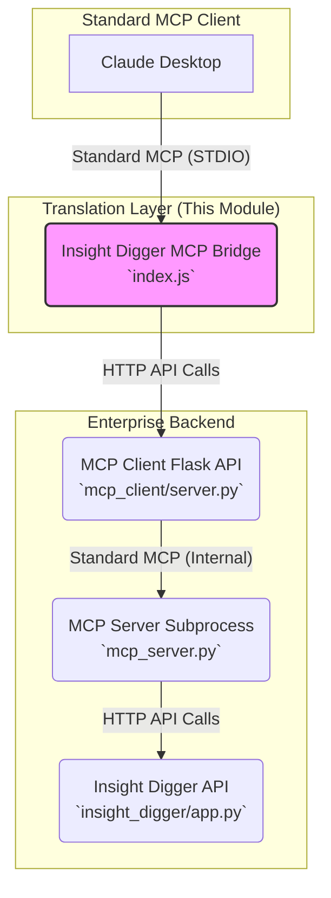

# Insight Digger MCP Bridge: Implementation Guide

## 1. Overview

This document provides a technical guide to the Insight Digger MCP Bridge, a lightweight Node.js module designed to connect standard Model Context Protocol (MCP) clients, such as Claude Desktop, with our enterprise-grade Insight Digger backend.

The primary role of this bridge is to act as a **translation layer**. It translates the standard MCP commands (communicated over STDIO) from the client into HTTP requests that our custom `mcp_client` Flask API can understand. This allows us to preserve the sophisticated features of our existing backend—such as dynamic JWT authentication, intelligent parameter caching, and session management—while offering standard MCP compatibility.

This module is packaged for distribution via NPM and can be run easily with `npx`, as defined in its `package.json`.

## 2. Architecture

The system employs a 3-layer architecture to meet enterprise requirements that are not handled by the standard MCP model alone.



1.  **Insight Digger MCP Bridge (`index.js`)**: The focus of this document. A minimal Node.js application that runs via `npx`. It manages the connection with the LLM client, handles the initial authentication handshake, and proxies all subsequent tool calls to our backend.
2.  **MCP Client Flask API (`mcp_client/server.py`)**: A custom Flask server that exposes a simple REST API (`/init`, `/tools`, `/call-tool`). It is the gatekeeper for our enterprise logic, managing session state, parameter caching, and secure credential handling for multiple concurrent users.
3.  **MCP Server & Insight Digger API**: The core backend that executes the actual data analysis workflows.

This architecture allows the bridge to remain simple and stateless, while all the complex, stateful logic is managed centrally by our robust Python backend.

## 3. Key Components of the Bridge (`index.js`)

The bridge is designed to be as minimal as possible, with its logic centered around a few key responsibilities.

### Configuration

The bridge requires minimal configuration via environment variables:
-   `MCP_CLIENT_URL`: The URL of the `mcp_client` Flask API (e.g., `http://127.0.0.1:33000`). This is the only required setting.
-   `BRIDGE_LOGGING_ENABLED`: Set to `true` to enable basic console logging for debugging. It is disabled by default to ensure clean operation.

### Session Management

A global `bridgeSession` object tracks the state of the connection for a single instance of the bridge:
```javascript
let bridgeSession = {
  sessionId: null,       // Unique ID for the session, generated on authentication.
  authenticated: false,  // Flag to track if the session is authenticated.
  availableTools: [],    // Stores the list of tools after authentication.
  workflowGuidance: null // Stores the workflow guidance from the backend.
};
```
This state determines which tools are presented to the LLM and how tool calls are handled.

### Authentication Flow (`setup_authentication`)

This is the most critical logic in the bridge. When the LLM calls the `setup_authentication` tool, the bridge performs a two-step handshake with the backend:
1.  **Initialize Session**: It sends the user-provided `apiUrl` and `jwtToken` to the `/init` endpoint of the `mcp_client`. The backend validates these credentials and creates a new session.
2.  **Fetch Tools**: It then calls the `/tools` endpoint to get the list of available analysis tools and the associated workflow guidance for the newly created session.

The `authenticated` flag is then set to `true`, and the fetched tools are stored in `bridgeSession`.

### Tool Presentation Logic

The bridge dynamically adjusts the tool list presented to the LLM based on the authentication state.

#### Before Authentication

- The bridge calls `createAuthenticationTool()` which fetches system information from the backend's `/tools-schema` endpoint.
- It constructs a detailed description for the `setup_authentication` tool, providing the LLM with crucial context about the system's purpose and capabilities.
- It also presents all other available tools but modifies their descriptions to include a `🔒 [Requires Authentication]` warning, guiding the user to authenticate first.

#### After Authentication

- The bridge presents the `setup_authentication` tool alongside the full list of tools received from the backend.
- The `enhanceToolsWithWorkflowGuidance()` function is called. It injects the detailed, step-by-step **Recommended Workflow** (provided by the backend) into the description of the first analysis tool. This explicit guidance is critical for helping the LLM navigate the multi-step analysis process correctly.

### Tool Call Proxy (`proxyToolCall`)

Once authenticated, any call to an analysis tool is simply proxied to the `/call-tool` endpoint of the `mcp_client` Flask API. The bridge sends the `sessionId`, tool name, and parameters. The backend handles the rest, including:
-   Injecting cached parameters (like `sourceId` or `columnAnalysis`).
-   Executing the tool via the `mcp_server.py` subprocess.
-   Caching the results for future use.

The bridge itself remains stateless regarding tool execution, ensuring all caching logic is preserved in the backend.

## 4. Installation and Usage

The bridge is packaged as a Node.js module, intended to be run with `npx`. The `package.json` defines the command and dependencies.

### Installation

For local development or testing, you can install it globally from the project directory:
```bash
npm install -g .
```
To use it directly, you can run `npx` from any directory:
```bash
npx @yourcompany/insight-digger-mcp
```
*(Note: `@yourcompany` is a placeholder for your actual NPM organization).*

### Configuration in Claude Desktop

To use the bridge with Claude Desktop, you configure it as a new MCP server in the settings:

```json
{
  "mcpServers": {
    "insight-digger-enterprise": {
      "command": "npx",
      "args": ["-y", "@yourcompany/insight-digger-mcp"],
      "env": {
        "MCP_CLIENT_URL": "http://127.0.0.1:33000"
      }
    }
  }
}
```
-   **command**: `npx` handles the execution and dependency management.
-   **args**: The `-y` flag auto-confirms the `npx` prompt, and `@yourcompany/insight-digger-mcp` is the name of the package.
-   **env**: Sets the required URL for the bridge to connect to the backend.

## 5. User Workflow Example

1.  **User**: Asks an analytical question (e.g., "Analyze my sales data").
2.  **Claude**: Sees the `setup_authentication` tool and asks for the `apiUrl` and `jwtToken`.
3.  **User**: Provides the credentials.
4.  **Claude**: Calls `setup_authentication`.
5.  **Bridge (`index.js`)**:
    -   Calls `/init` on the backend to validate credentials and start a session.
    -   Calls `/tools` to get the list of authenticated tools and workflow guidance.
    -   Reloads the toolset, now with the workflow guidance injected.
6.  **Claude**: Now sees the full list of tools and the recommended workflow. It follows the first step and asks the user for a data source to search for.
7.  **User**: "Look for Q4 sales data".
8.  **Claude**: Calls the `list_sources` tool.
9.  **Bridge**: Proxies the call to the `/call-tool` endpoint. The backend handles the execution and returns the results.
10. **Process Repeats**: Claude continues to call the analysis tools in sequence, following the workflow. The bridge transparently proxies each call, and the backend manages the caching and state. 