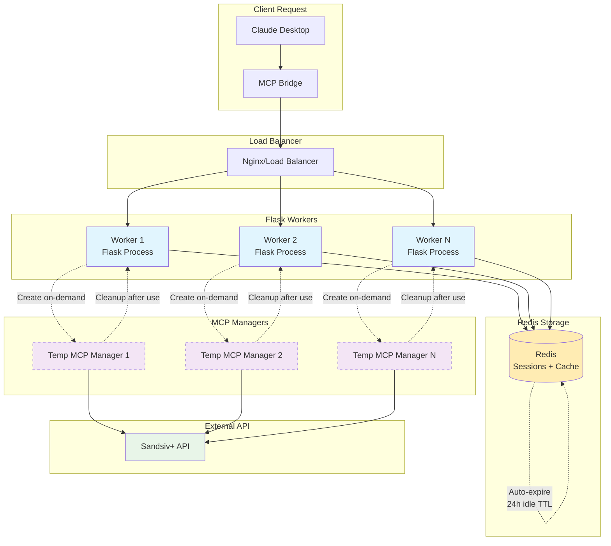

# Redis-Only Architecture Documentation

## Overview

This document describes the Redis-only session management architecture implemented for the MCP Client system. This design ensures scalability, reliability, and stateless operation across multiple workers.

## Architecture Diagram



## Component Descriptions

### Client Layer
- **Claude Desktop**: The AI assistant that initiates requests
- **MCP Bridge**: Translates MCP protocol to HTTP requests

### Load Balancer Layer
- **Nginx/Load Balancer**: Distributes requests across multiple Flask workers
- Enables horizontal scaling and high availability
- Can be configured with health checks and failover

### Application Layer
- **Flask Workers**: Multiple stateless Flask processes handling HTTP requests
- Each worker can handle requests for any session (no process affinity required)
- Workers scale independently based on load

### Storage Layer
- **Redis**: Centralized session storage with automatic TTL management
- Stores session data, cached parameters, and workflow state
- Handles automatic cleanup through idle-based TTL (24 hours default)

### Processing Layer
- **MCP Managers**: Temporary subprocess managers created on-demand
- Created fresh for each request requiring MCP access
- Immediately cleaned up after request completion
- No persistent state or caching

### External Integration
- **Sandsiv+ API**: External data analysis API
- Accessed through MCP managers for tool execution

## Key Design Principles

### 1. Stateless Workers
```python
# Each request creates a fresh MCP manager
mcp_manager = create_mcp_manager_for_request(session_id)
try:
    # Execute request
    result = mcp_manager.call_tool(tool_name, params)
finally:
    # Always cleanup
    mcp_manager.stop()
```

**Benefits:**
- Any worker can handle any request
- No worker affinity required
- Simplified load balancing
- Easy horizontal scaling

### 2. Redis-Only Storage
```python
# All session data in Redis with automatic TTL
session_data = session_manager.get_session_data(session_id)  # Resets TTL
session_manager.update_session_data(session_id, updates)    # Resets TTL
```

**Benefits:**
- Sessions survive service restarts
- Shared across all workers
- Automatic cleanup via TTL
- No background cleanup threads needed

### 3. On-Demand Resource Creation
```python
# Create MCP manager only when needed
def create_mcp_manager_for_request(session_id):
    if not session_manager.touch_session(session_id):
        return None
    return MCPServerManager(server_script=MCPConfig.MCP.SERVER_SCRIPT)
```

**Benefits:**
- Optimal resource utilization
- No persistent subprocess management
- Immediate cleanup prevents resource leaks
- Simplified error handling

### 4. Idle-Based TTL
```python
# Every access resets TTL to full duration
def get_session_data(self, session_id):
    # ... get data ...
    self.redis.setex(redis_key, self.idle_ttl, updated_data)  # Reset TTL
```

**Benefits:**
- Active sessions never expire
- Inactive sessions automatically cleaned up
- No manual session management required
- Predictable resource usage

## Request Flow

### 1. Session Creation (`/init`)
```
1. Client → Load Balancer → Worker
2. Worker validates credentials with external API
3. Worker stores session data in Redis with TTL
4. Worker returns success
```

### 2. Tool Execution (`/call-tool`)
```
1. Client → Load Balancer → Any Available Worker
2. Worker retrieves session data from Redis (resets TTL)
3. Worker creates temporary MCP manager
4. Worker executes tool through MCP manager
5. Worker caches results in Redis session
6. Worker cleans up MCP manager
7. Worker returns filtered results to client
```

### 3. Session Expiration
```
1. Redis automatically expires sessions after 24h of inactivity
2. No background cleanup processes needed
3. Next access to expired session returns "not found"
4. Client can re-initialize with /init if needed
```

## Scaling Characteristics

### Horizontal Scaling
- **Add Workers**: Simply start more Flask processes
- **Load Balancing**: Standard HTTP load balancing works
- **No Coordination**: Workers don't need to communicate
- **Shared State**: All workers access same Redis sessions

### Vertical Scaling
- **Redis Capacity**: Single Redis can handle thousands of sessions
- **Worker Memory**: Each worker only holds temporary MCP managers
- **CPU Usage**: On-demand creation optimizes CPU usage

### Geographic Distribution
- **Redis Clustering**: For multi-region deployments
- **Local Workers**: Workers can be distributed geographically
- **Session Affinity**: Not required - any worker can serve any session

## Operational Benefits

### Deployment
- **Zero Downtime**: Rolling updates possible
- **Session Persistence**: Sessions survive deployments
- **Configuration**: Centralized in shared config system
- **Monitoring**: Single Redis instance to monitor

### Debugging
- **Session Inspection**: Direct Redis access for debugging
- **Stateless Workers**: No worker-specific state to debug
- **Centralized Logs**: All session activity in Redis
- **TTL Monitoring**: Easy to check session expiration

### Maintenance
- **No Background Jobs**: No cleanup processes to manage
- **Automatic Cleanup**: Redis TTL handles all cleanup
- **Simple Architecture**: Fewer moving parts
- **Predictable Behavior**: No race conditions or timing issues

## Migration Benefits

### From Previous Architecture
- **Eliminated Complexity**: No dual-layer management
- **Removed Polling**: No background cleanup threads
- **Fixed Race Conditions**: No coordination between layers
- **Improved Reliability**: No orphaned processes

### Backward Compatibility
- **HTTP Endpoints**: All endpoints unchanged
- **Client Behavior**: Identical from client perspective
- **Configuration**: Same environment variables
- **Session IDs**: Existing session IDs continue to work

## Performance Characteristics

### Memory Usage
- **Redis**: Session data (~1-10KB per session)
- **Workers**: Only temporary MCP managers during requests
- **No Leaks**: Immediate cleanup prevents accumulation

### CPU Usage
- **On-Demand**: MCP managers created only when needed
- **Parallel**: Multiple workers can create managers simultaneously
- **Efficient**: No background polling or cleanup

### Network Usage
- **Redis**: Fast local connections for session data
- **MCP**: Temporary connections to external API
- **HTTP**: Standard request/response patterns

This architecture provides a robust, scalable foundation for the MCP Client system while maintaining simplicity and operational efficiency. 