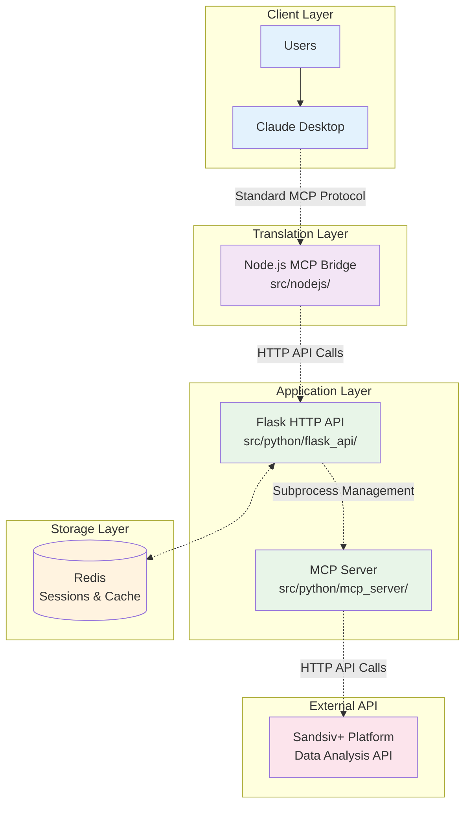

# Insight Digger MCP - Documentation Index

Welcome to the comprehensive documentation for the Insight Digger MCP system. This documentation is designed to provide complete understanding of the project architecture, implementation details, and usage patterns.

## 🎯 What is Insight Digger MCP?

Insight Digger MCP is an enterprise-grade Model Context Protocol (MCP) system that enables AI assistants like Claude Desktop to perform sophisticated data analysis workflows. It transforms business questions into interactive dashboards and AI-powered insights using the Sandsiv+ data analysis platform.

## 🏗️ System Architecture

The system consists of three main components working together:

## 📚 Documentation Sections

### 🔍 Overview & Understanding
Get familiar with the project's purpose, architecture, and structure.

| Document | Description | Audience |
|----------|-------------|----------|
| [**Project Overview**](overview/project-overview.md) | High-level project description, goals, and key features | All users |
| [**Architecture**](overview/architecture.md) | Detailed system architecture and component interactions | Developers, Architects |
| [**Project Structure**](overview/project-structure.md) | Directory structure and file organization | Developers |

### 🚀 Setup & Configuration
Everything needed to get the system running.

| Document | Description | Audience |
|----------|-------------|----------|
| [**Installation**](setup/installation.md) | Step-by-step installation guide | All users |
| [**Configuration**](setup/configuration.md) | Configuration options and environment setup | Administrators |
| [**Quick Start**](setup/quick-start.md) | Fastest path to a working system | New users |

### 🔧 Component Documentation
Deep dives into each system component.

| Document | Description | Audience |
|----------|-------------|----------|
| [**Flask API**](components/flask-api.md) | HTTP API server implementation details | Developers |
| [**MCP Server**](components/mcp-server.md) | MCP protocol server and tools | Developers |
| [**MCP Bridge**](components/mcp-bridge.md) | Node.js bridge for Claude Desktop | Developers |
| [**Session Management**](components/session-management.md) | Redis-based session architecture | Developers, Architects |

### 🔗 Integration Guides
How to integrate with and use the system.

| Document | Description | Audience |
|----------|-------------|----------|
| [**Claude Desktop**](integration/claude-desktop.md) | Setting up Claude Desktop integration | End users |
| [**API Integration**](integration/api-integration.md) | HTTP API integration for custom clients | Developers |
| [**Workflow Examples**](integration/workflow-examples.md) | Common usage patterns and examples | All users |

### 📖 API Reference
Complete API documentation and tool references.

| Document | Description | Audience |
|----------|-------------|----------|
| [**HTTP API Reference**](api/http-api.md) | Complete HTTP API documentation | Developers |
| [**MCP Tools Reference**](api/mcp-tools.md) | All MCP tools with parameters and examples | Developers, AI Engineers |
| [**Configuration Reference**](api/configuration-reference.md) | All configuration options and environment variables | Administrators |

### 💻 Development
Resources for developers working on the system.

| Document | Description | Audience |
|----------|-------------|----------|
| [**Development Setup**](development/development-setup.md) | Setting up development environment | Contributors |
| [**Testing**](development/testing.md) | Testing strategies and running tests | Contributors |
| [**Contributing**](development/contributing.md) | Contribution guidelines and standards | Contributors |
| [**Architecture Decisions**](development/architecture-decisions.md) | Design decisions and rationale | Architects, Contributors |

### 🚀 Deployment & Operations
Production deployment and operational guidance.

| Document | Description | Audience |
|----------|-------------|----------|
| [**Production Deployment**](deployment/production-deployment.md) | Complete production deployment guide | DevOps, Administrators |
| [**Monitoring**](deployment/monitoring.md) | Monitoring, logging, and observability | DevOps, Administrators |
| [**Troubleshooting**](deployment/troubleshooting.md) | Common issues and solutions | All users |
| [**Security**](deployment/security.md) | Security considerations and best practices | Security Engineers, Administrators |

### 📋 Reference Materials
Additional reference information and resources.

| Document | Description | Audience |
|----------|-------------|----------|
| [**Changelog**](reference/changelog.md) | Version history and release notes | All users |
| [**Migration Guide**](reference/migration-guide.md) | Upgrading and migration instructions | Administrators |
| [**Glossary**](reference/glossary.md) | Terms, definitions, and concepts | All users |

## 🎯 Quick Navigation by Role

### 👤 **End Users** (Using Claude Desktop)
1. Start with [Project Overview](overview/project-overview.md)
2. Follow [Claude Desktop Integration](integration/claude-desktop.md)
3. Learn [Workflow Examples](integration/workflow-examples.md)
4. Reference [Troubleshooting](deployment/troubleshooting.md) if needed

### 👨‍💻 **Developers** (Integrating via API)
1. Understand [Architecture](overview/architecture.md)
2. Follow [Installation](setup/installation.md)
3. Study [API Integration](integration/api-integration.md)
4. Reference [HTTP API](api/http-api.md) and [MCP Tools](api/mcp-tools.md)

### 🏗️ **Contributors** (Working on the codebase)
1. Review [Project Structure](overview/project-structure.md)
2. Set up [Development Environment](development/development-setup.md)
3. Read [Contributing Guidelines](development/contributing.md)
4. Understand [Architecture Decisions](development/architecture-decisions.md)

### 🚀 **DevOps/Administrators** (Deploying and managing)
1. Review [Architecture](overview/architecture.md)
2. Follow [Production Deployment](deployment/production-deployment.md)
3. Set up [Monitoring](deployment/monitoring.md)
4. Review [Security](deployment/security.md) considerations

## 🔄 Documentation Maintenance

This documentation is actively maintained and updated with each release. For the most current information:

- **Version**: Check [Changelog](reference/changelog.md) for latest updates
- **Issues**: Report documentation issues via GitHub issues
- **Contributions**: See [Contributing](development/contributing.md) for documentation contributions

## 📞 Getting Help

- **Quick Issues**: Check [Troubleshooting](deployment/troubleshooting.md)
- **API Questions**: Reference [HTTP API](api/http-api.md) or [MCP Tools](api/mcp-tools.md)
- **Setup Problems**: Follow [Installation](setup/installation.md) step-by-step
- **Integration Help**: Review [Integration Guides](integration/)

---

*This documentation is designed to be comprehensive yet accessible. Each section builds upon the previous ones, so following the suggested reading order will provide the best understanding of the system.* 