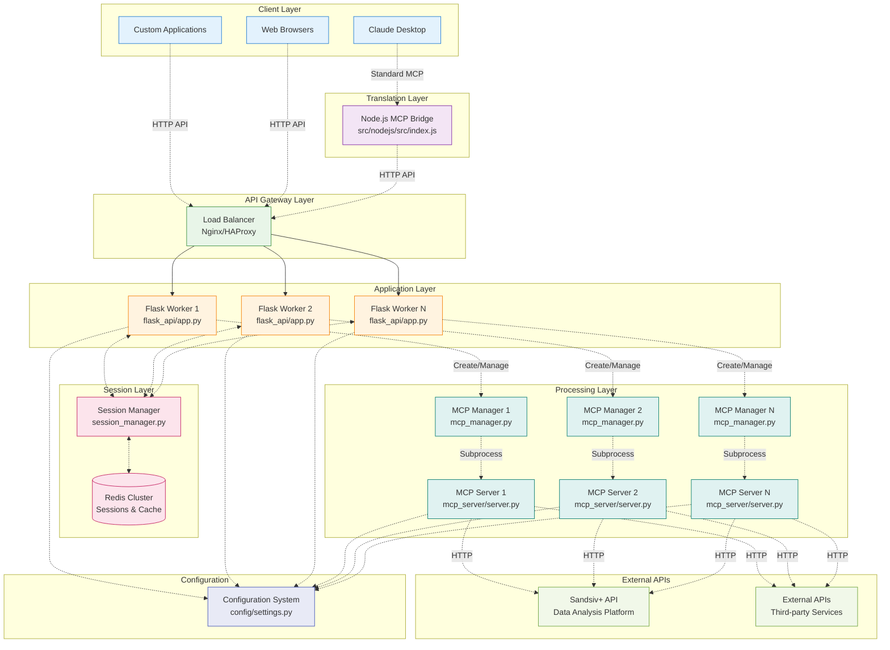
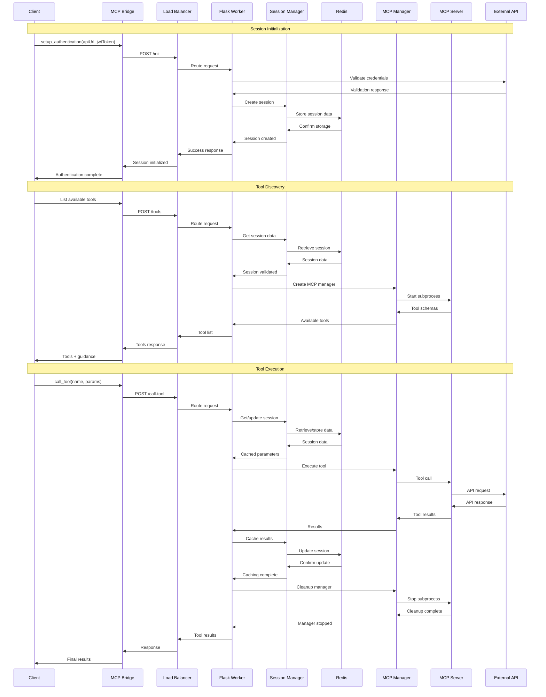
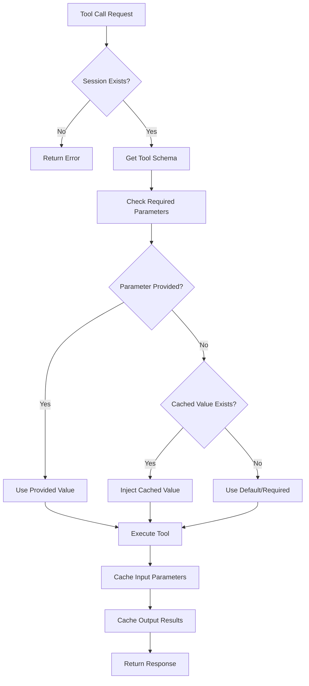
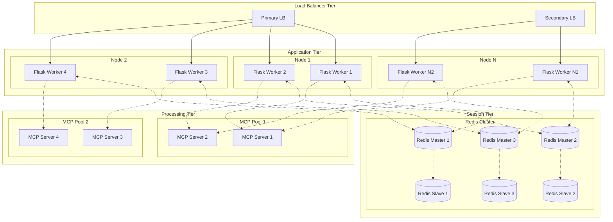
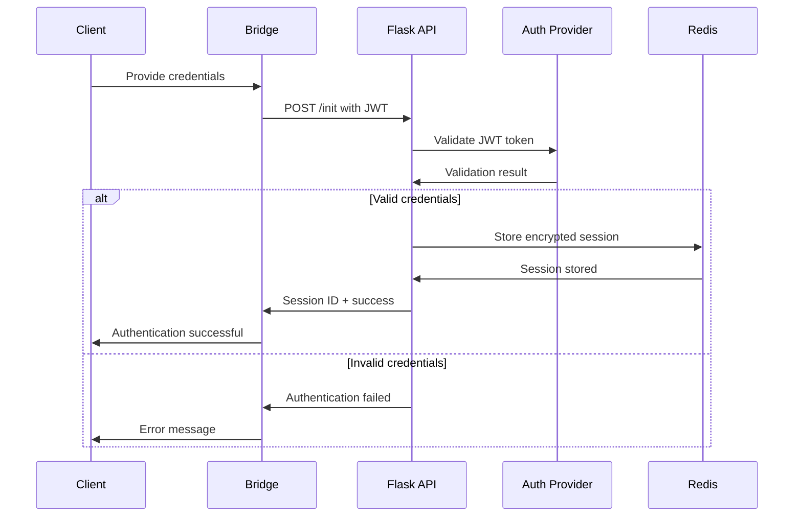
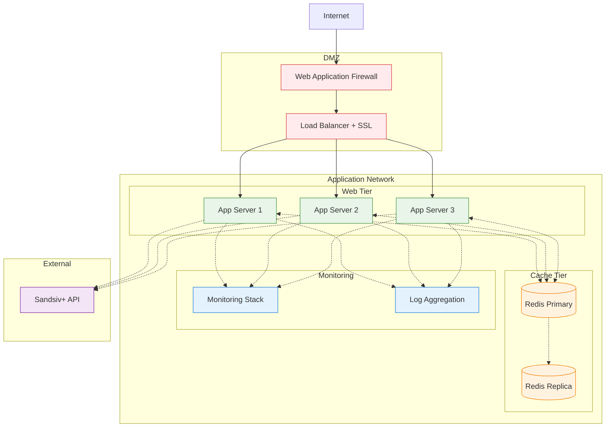

# System Architecture

## Overview

The Insight Digger MCP system employs a sophisticated multi-layered architecture designed for enterprise scalability, security, and maintainability. The system bridges AI assistants with data analysis capabilities through a translation layer that preserves enterprise features while providing standard MCP compatibility.

## Architectural Principles

### 1. **Separation of Concerns**
Each component has a single, well-defined responsibility:
- **MCP Bridge**: Protocol translation and client management
- **Flask API**: Session management and enterprise logic
- **MCP Server**: Tool execution and data processing
- **Redis**: State management and caching

### 2. **Stateless Design**
- Workers can handle any request without affinity
- All state stored in Redis with automatic TTL
- Horizontal scaling without coordination
- Graceful handling of worker failures

### 3. **Security-First**
- JWT-based authentication at every layer
- Sensitive parameter filtering throughout
- Session isolation between users
- Secure credential management

### 4. **Performance Optimization**
- Intelligent parameter caching and injection
- Connection pooling for external APIs
- Asynchronous processing where possible
- Resource cleanup and management

## System Components

### Component Diagram



## Key Design Patterns

### 1. **Request-Response Flow**
Every request follows a consistent pattern:
1. Authentication validation
2. Session retrieval/creation
3. Parameter injection from cache
4. Tool execution
5. Result caching
6. Response delivery

### 2. **Resource Management**
- MCP servers created on-demand per request
- Automatic cleanup after tool execution
- Connection pooling for external APIs
- Memory-efficient session storage

### 3. **Error Handling**
- Graceful degradation on component failures
- Circuit breaker patterns for external APIs
- Comprehensive logging and monitoring
- Automatic retry mechanisms

This architecture ensures enterprise-grade reliability, security, and performance while maintaining compatibility with standard MCP protocols.

## Layer-by-Layer Analysis

### 1. Client Layer

#### Claude Desktop Integration
**Purpose**: Standard MCP client for AI assistants
**Protocol**: MCP over STDIO
**Features**:
- Native AI assistant integration
- Standard MCP tool discovery
- Authentication flow management
- Workflow guidance presentation

#### Custom Application Integration
**Purpose**: Direct HTTP API access for custom clients
**Protocol**: HTTP REST API
**Features**:
- Session-based authentication
- Tool execution and caching
- Custom workflow implementation
- Direct API access

### 2. Translation Layer

#### Node.js MCP Bridge
**Location**: `src/nodejs/src/index.js`
**Purpose**: Translate between MCP protocol and HTTP API

```javascript
// Key components of the bridge
const bridgeSession = {
  sessionId: null,
  authenticated: false,
  availableTools: [],
  workflowGuidance: null
};

// Authentication flow
async function setupAuthentication(args) {
  // 1. Initialize session with Flask API
  // 2. Fetch available tools
  // 3. Update tool presentation
}

// Tool call proxy
async function proxyToolCall(toolName, args) {
  // 1. Validate authentication
  // 2. Proxy to Flask API
  // 3. Return results
}
```

**Key Features**:
- Stateless design with session management
- Dynamic tool presentation based on authentication
- Workflow guidance injection
- Error handling and logging

### 3. API Gateway Layer

#### Load Balancer (Nginx/HAProxy)
**Purpose**: Distribute requests across Flask workers
**Configuration**:
```nginx
upstream flask_backend {
    server 127.0.0.1:33000;
    server 127.0.0.1:33001;
    server 127.0.0.1:33002;
}

server {
    listen 80;
    location / {
        proxy_pass http://flask_backend;
        proxy_set_header Host $host;
        proxy_set_header X-Real-IP $remote_addr;
    }
}
```

**Features**:
- Health check integration
- SSL termination
- Request routing
- Rate limiting

### 4. Application Layer

#### Flask Workers
**Location**: `src/python/insight_digger_mcp/flask_api/app.py`
**Purpose**: Enterprise HTTP API with session management

```python
# Key endpoints
@app.route('/init', methods=['POST'])
def init():
    # Session initialization and credential validation
    
@app.route('/tools', methods=['POST'])
def list_tools():
    # Tool discovery with session context
    
@app.route('/call-tool', methods=['POST'])
def call_tool():
    # Tool execution with parameter injection
```

**Key Features**:
- Multi-session support
- Credential validation
- Parameter caching and injection
- MCP server subprocess management

### 5. Session Layer

#### Session Manager
**Location**: `src/python/insight_digger_mcp/flask_api/session_manager.py`
**Purpose**: Redis-based session management

```python
class MCPSessionManager:
    def __init__(self):
        self.redis = redis.Redis(**MCPConfig.get_redis_connection_params())
        self.idle_ttl = MCPConfig.Session.IDLE_TTL
        
    def create_session(self, session_id, session_data):
        # Create session with TTL
        
    def get_session_data(self, session_id):
        # Retrieve and refresh TTL
        
    def update_session_data(self, session_id, updates):
        # Update and refresh TTL
```

**Key Features**:
- Automatic TTL management
- Session isolation
- Parameter caching
- Multi-worker compatibility

#### Redis Storage
**Purpose**: Distributed session storage and caching
**Configuration**:
```yaml
redis:
  host: localhost
  port: 6379
  db: 0
  ssl: false
  password: ${REDIS_PASSWORD}
```

**Data Structures**:
```json
{
  "mcp_session:session-123": {
    "apiUrl": "https://api.example.com",
    "jwtToken": "encrypted_token",
    "sourceId": "cached_source_id",
    "question": "cached_question",
    "strategy": {...},
    "last_accessed": "2024-01-01T12:00:00Z"
  }
}
```

### 6. Processing Layer

#### MCP Managers
**Location**: `src/python/insight_digger_mcp/flask_api/mcp_manager.py`
**Purpose**: Manage MCP server subprocesses

```python
class MCPServerManager:
    def start(self):
        # Start MCP server subprocess
        
    def call_tool(self, tool_name, params):
        # Execute tool via MCP protocol
        
    def stop(self):
        # Clean shutdown of subprocess
```

**Lifecycle**:
1. Created on-demand for each request
2. Starts MCP server subprocess
3. Executes tool via MCP protocol
4. Returns results and cleans up

#### MCP Servers
**Location**: `src/python/insight_digger_mcp/mcp_server/server.py`
**Purpose**: Tool execution and data processing

```python
# Tool definition example
@mcp.tool(description="List available data sources")
async def list_sources(apiUrl: str, jwtToken: str, search: str = "") -> dict:
    headers = {"X-API-URL": apiUrl, "X-JWT-TOKEN": jwtToken}
    result = await get("/sources", headers=headers, params={"search": search})
    return result
```

**Key Features**:
- FastMCP-based tool definitions
- Async HTTP client for external APIs
- Comprehensive error handling
- Structured logging

### 7. External Integration Layer

#### Sandsiv+ API
**Purpose**: Primary data analysis platform
**Integration**: HTTP REST API with JWT authentication
**Capabilities**:
- Data source discovery
- Schema analysis
- Dashboard creation
- Chart data retrieval

#### Configuration System
**Location**: `config/settings.py`
**Purpose**: Centralized configuration management

```python
class MCPConfig:
    class API:
        BASE_URL = os.getenv("INSIGHT_DIGGER_API_URL", "https://api.sandsiv.com")
        DEFAULT_TIMEOUT = int(os.getenv("MCP_API_DEFAULT_TIMEOUT", 60))
        
    class Redis:
        HOST = os.getenv("REDIS_HOST", "localhost")
        PORT = int(os.getenv("REDIS_PORT", 6379))
        
    class Session:
        IDLE_TTL = int(os.getenv("MCP_SESSION_IDLE_TTL", 24 * 3600))
```

## Data Flow Architecture

### Request Processing Flow



### Caching Strategy

#### Parameter Injection Flow


#### Session Data Structure
```json
{
  "session_metadata": {
    "session_id": "bridge-uuid-123",
    "created_at": "2024-01-01T12:00:00Z",
    "last_accessed": "2024-01-01T12:30:00Z",
    "ttl": 86400
  },
  "authentication": {
    "apiUrl": "https://api.sandsiv.com",
    "jwtToken": "encrypted_jwt_token"
  },
  "cached_parameters": {
    "sourceId": "data-source-123",
    "question": "What are the main factors affecting sales?",
    "columnAnalysis": [...],
    "strategy": {...},
    "markdownConfig": "...",
    "chartConfigs": [...]
  },
  "workflow_state": {
    "current_step": "analyze_charts",
    "completed_steps": ["list_sources", "analyze_structure", "generate_strategy"],
    "next_suggested_step": "create_dashboard"
  }
}
```

## Scalability Architecture

### Horizontal Scaling Pattern



### Performance Characteristics

| Component | Scaling Method | Bottleneck | Mitigation |
|-----------|----------------|------------|------------|
| MCP Bridge | Process per client | Memory usage | Connection pooling |
| Flask API | Horizontal workers | CPU/Memory | Load balancing |
| Redis | Cluster/Sharding | Memory/Network | Redis Cluster |
| MCP Server | On-demand subprocess | Process creation | Process pooling |
| External API | Connection pooling | Rate limits | Circuit breakers |

## Security Architecture

### Authentication Flow



### Security Layers

1. **Transport Security**
   - HTTPS/TLS for all HTTP communication
   - Secure WebSocket connections for real-time features
   - Certificate validation and pinning

2. **Authentication Security**
   - JWT token validation at API gateway
   - Session-based authentication for multi-step workflows
   - Credential encryption in Redis storage

3. **Authorization Security**
   - Session-based access control
   - Resource-level permissions
   - API rate limiting per session

4. **Data Security**
   - Sensitive parameter filtering in logs
   - Encrypted storage of credentials
   - Automatic session expiration

## Deployment Architecture

### Production Deployment



### Container Architecture

```dockerfile
# Multi-stage build for production
FROM python:3.11-slim as base
WORKDIR /app
COPY requirements.txt .
RUN pip install --no-cache-dir -r requirements.txt

FROM node:18-slim as bridge
WORKDIR /app
COPY src/nodejs/package*.json ./
RUN npm ci --only=production

FROM base as production
COPY src/python/ ./src/python/
COPY config/ ./config/
COPY --from=bridge /app/node_modules ./src/nodejs/node_modules
COPY --from=bridge /app/src ./src/nodejs/src

EXPOSE 33000
CMD ["python", "src/python/scripts/start_flask_api.py"]
```

## Monitoring and Observability

### Metrics Collection

```python
# Example metrics instrumentation
from prometheus_client import Counter, Histogram, Gauge

# Request metrics
request_count = Counter('http_requests_total', 'Total HTTP requests', ['method', 'endpoint', 'status'])
request_duration = Histogram('http_request_duration_seconds', 'HTTP request duration')

# Session metrics
active_sessions = Gauge('active_sessions_total', 'Number of active sessions')
session_duration = Histogram('session_duration_seconds', 'Session duration')

# Tool execution metrics
tool_calls = Counter('tool_calls_total', 'Total tool calls', ['tool_name', 'status'])
tool_duration = Histogram('tool_execution_duration_seconds', 'Tool execution time', ['tool_name'])
```

### Health Checks

```python
@app.route('/health')
def health():
    checks = {
        'redis': check_redis_connection(),
        'external_api': check_external_api(),
        'disk_space': check_disk_space(),
        'memory_usage': check_memory_usage()
    }
    
    if all(checks.values()):
        return jsonify({'status': 'healthy', 'checks': checks}), 200
    else:
        return jsonify({'status': 'unhealthy', 'checks': checks}), 503
```

This architecture provides a robust, scalable, and secure foundation for enterprise data analysis workflows while maintaining compatibility with standard MCP protocols. 