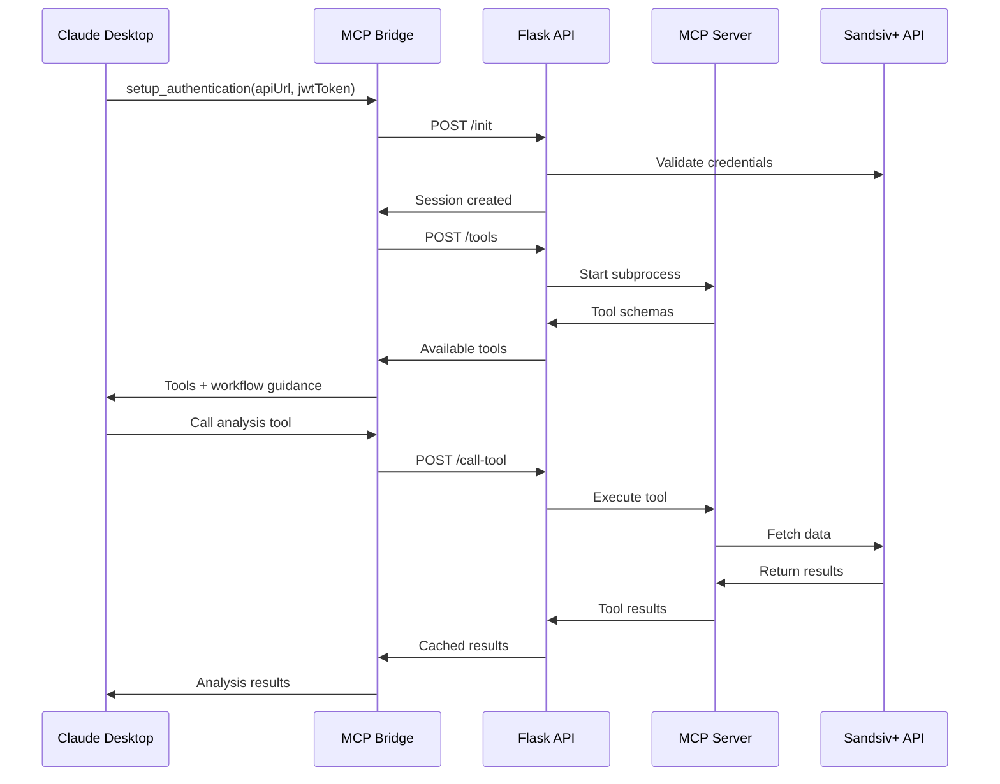
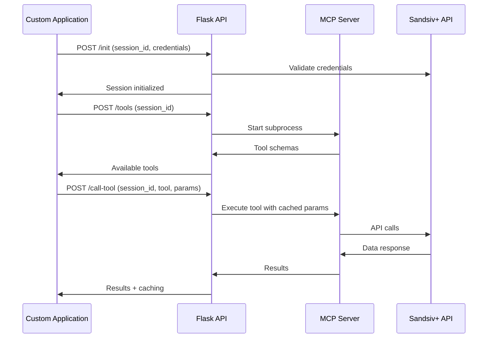

# Project Overview

## What is Insight Digger MCP?

Insight Digger MCP is an enterprise-grade Model Context Protocol (MCP) system that bridges AI assistants with sophisticated data analysis capabilities. It enables AI assistants like Claude Desktop to perform complex analytical workflows by transforming business questions into interactive dashboards and actionable insights.

## Key Features

### 🤖 **AI-Native Data Analysis**
- Natural language to data analysis workflow conversion
- Multi-step analytical processes guided by AI
- Intelligent parameter caching and workflow optimization
- Context-aware tool suggestions and guidance

### 🏢 **Enterprise-Grade Architecture**
- Multi-tenant session management with Redis
- JWT-based authentication and authorization
- Horizontal scaling with stateless workers
- Production-ready deployment with monitoring

### 🔧 **Flexible Integration**
- Standard MCP protocol support for Claude Desktop
- HTTP REST API for custom integrations
- Node.js bridge for seamless MCP client connections
- Extensible tool system for custom workflows

### 📊 **Comprehensive Analytics**
- Source discovery and structure analysis
- Strategy generation for complex questions
- Dashboard creation and configuration
- Chart data fetching and insight generation

## System Components

### 1. **MCP Bridge** (Node.js)
**Location**: `src/nodejs/`
**Purpose**: Translation layer between standard MCP clients and the enterprise backend

- Handles authentication flow with AI assistants
- Translates MCP protocol to HTTP API calls
- Manages session state for Claude Desktop integration
- Provides workflow guidance to AI assistants

### 2. **Flask HTTP API** (Python)
**Location**: `src/python/insight_digger_mcp/flask_api/`
**Purpose**: Enterprise-grade HTTP API server with session management

- Multi-session support with Redis storage
- Intelligent parameter caching and injection
- JWT authentication and credential validation
- MCP server subprocess management

### 3. **MCP Server** (Python)
**Location**: `src/python/insight_digger_mcp/mcp_server/`
**Purpose**: Direct MCP protocol implementation with analytical tools

- FastMCP-based tool definitions
- Async HTTP calls to Sandsiv+ API
- Comprehensive logging and error handling
- Modular tool architecture

### 4. **Configuration System** (Python)
**Location**: `config/`
**Purpose**: Centralized configuration management

- Environment-specific settings
- Redis connection configuration
- API endpoint and timeout settings
- Security parameter definitions

## Core Capabilities

### Data Source Management
- **List Sources**: Discover available data sources with search and filtering
- **Analyze Structure**: Deep analysis of data source schemas and column types
- **Source Validation**: Verify data source accessibility and permissions

### Analytical Workflow
- **Strategy Generation**: Create analytical strategies based on business questions
- **Configuration Creation**: Generate dashboard configurations for review and modification
- **Dashboard Creation**: Build interactive dashboards from configurations
- **Data Fetching**: Retrieve chart data for analysis

### Insight Generation
- **Chart Analysis**: AI-powered analysis of individual charts
- **Pattern Recognition**: Identify trends, outliers, and significant patterns
- **Report Synthesis**: Combine multiple insights into comprehensive reports
- **Recommendation Engine**: Suggest next steps and deeper analysis opportunities

## Target Use Cases

### 1. **Business Intelligence**
- Executive dashboard creation
- KPI monitoring and alerting
- Trend analysis and forecasting
- Performance benchmarking

### 2. **Data Exploration**
- Exploratory data analysis
- Hypothesis testing
- Correlation discovery
- Anomaly detection

### 3. **Report Generation**
- Automated report creation
- Custom visualization generation
- Multi-source data integration
- Scheduled analysis workflows

### 4. **Decision Support**
- What-if scenario analysis
- Risk assessment
- Opportunity identification
- Strategic planning support

## Technology Stack

### Backend Technologies
- **Python 3.8+**: Core application logic
- **Flask**: HTTP API framework
- **FastMCP**: MCP protocol implementation
- **Redis**: Session storage and caching
- **httpx**: Async HTTP client for external APIs

### Frontend Integration
- **Node.js**: MCP bridge implementation
- **Claude Desktop**: Primary AI assistant integration
- **Standard MCP Protocol**: Compatibility with MCP ecosystem

### Infrastructure
- **Docker**: Containerization support
- **Systemd**: Linux service management
- **Nginx**: Load balancing and reverse proxy
- **Redis**: Distributed caching and session storage

## Security Model

### Authentication & Authorization
- **JWT-based authentication** for API access
- **Session-based authorization** for multi-tenant access
- **Credential validation** against external APIs
- **Secure parameter filtering** in tool schemas

### Data Protection
- **Sensitive parameter masking** in logs and responses
- **Session isolation** between different users
- **Automatic session expiration** with configurable TTL
- **Secure credential storage** in Redis

### Network Security
- **HTTPS enforcement** for production deployments
- **CORS configuration** for web-based integrations
- **Rate limiting** support for API endpoints
- **Firewall-friendly architecture** with minimal port requirements

## Performance Characteristics

### Scalability
- **Horizontal scaling**: Add workers without coordination
- **Stateless architecture**: No worker affinity required
- **Redis clustering**: Scale session storage independently
- **Load balancer ready**: Standard HTTP load balancing

### Efficiency
- **Intelligent caching**: Reduce redundant API calls
- **Parameter injection**: Minimize data transfer
- **Connection pooling**: Optimize external API usage
- **Resource cleanup**: Automatic subprocess management

### Reliability
- **Graceful degradation**: Handle partial system failures
- **Automatic recovery**: Self-healing subprocess management
- **Circuit breaker patterns**: Protect against cascade failures
- **Comprehensive logging**: Full audit trail for debugging

## Integration Patterns

### Standard MCP Integration

### Direct API Integration

## Getting Started

### For AI Assistant Users
1. **Install**: Set up Claude Desktop integration
2. **Authenticate**: Provide Sandsiv+ credentials
3. **Explore**: Ask analytical questions in natural language
4. **Analyze**: Follow AI-guided workflows for deep insights

### For Developers
1. **Install**: Set up development environment
2. **Configure**: Set up Redis and API credentials
3. **Integrate**: Use HTTP API or extend MCP tools
4. **Deploy**: Follow production deployment guide

### For Administrators
1. **Deploy**: Set up production infrastructure
2. **Configure**: Environment-specific settings
3. **Monitor**: Set up logging and monitoring
4. **Maintain**: Regular updates and security patches

## Next Steps

- **Quick Start**: Follow the [Quick Start Guide](../setup/quick-start.md)
- **Architecture**: Understand the [System Architecture](architecture.md)
- **Integration**: Choose your [Integration Method](../integration/)
- **Development**: Set up [Development Environment](../development/development-setup.md) 